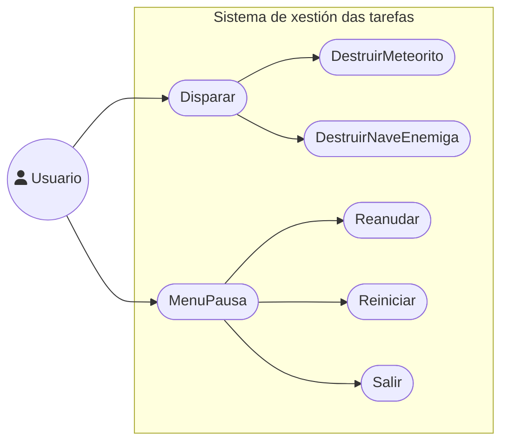

# Análise: Requirimentos do sistema

## Descrición xeral

## Casos de uso

## Funcionalidades

### FUNCIONAIS

- Añadir funcionalidades novas e melloradas ao xogo matamarcianos.
- Correción de bugs.

### NON FUNCIONAIS

- Soporte para diferentes resolucións de pantalla.
- Soporte para diferentes idiomas.
- Menu de pausa.

## Tipos de usuarios

- Usuario: pode interactuar ca nave, disparar e superar a sua mellor puntuación.
