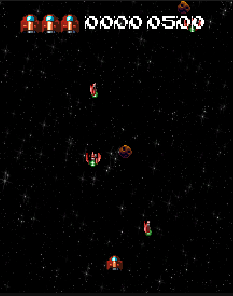
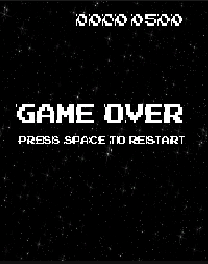
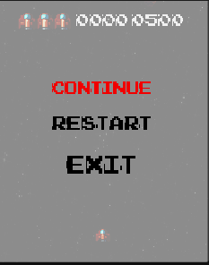

# Manual de usuario

## Escenario
El escenario de la aplicación es el siguiente:
- La nave roja inferior es la nave del jugador.
- Las otras naves son naves enemigas.
- Los meteoritos son obstáculos que se deben evitar.
- Si cualquier nave enemiga o meteorito toca la nave del jugador pierdes una vida

## Sin vidas
Cuando te quedas sin vidas, aparece la siguiente pantalla:
Puedes reiniciar el juego presionando la tecla "Espacio"

## Menu pausa
Cuando pulsas la tecla "Esc" aparece el siguiente menú de pausa:
La primera opción es "Continuar" que te permite seguir jugando, la segunda opción es "Reiniciar" que reinicia el juego y la tercera opción es "Salir" que cierra el juego.
